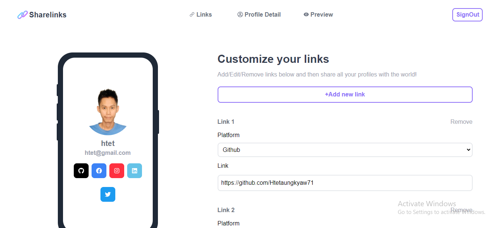

# ShareLinks Backend

Link-sharing app

## Description

Link-Sharing app. Users can create, read, update, delete links, and see previews in the mobile mockup. Authentication included.

## Getting Started
```
git clone git@github.com:Htetaungkyaw71/Sharelink_backend.git
```
### Screenshot


### Live demo

* Sharelinks
[@Link](https://slink-non2.onrender.com/)

### Technologies
* React
* Redux-toolkit
* Redux-toolkit query
* Tailwind CSS
* Nodejs
* Expressjs
* Jsonwebtoken


### Installing
```
 npm install
```

### Executing program

* How to run the program
```
npm run dev
```


## Authors

* Htetaungkyaw
[@Htetaungkyaw](https://github.com/Htetaungkyaw71)


## License

This project is licensed under the [NAME HERE] License - see the LICENSE.md file for details
